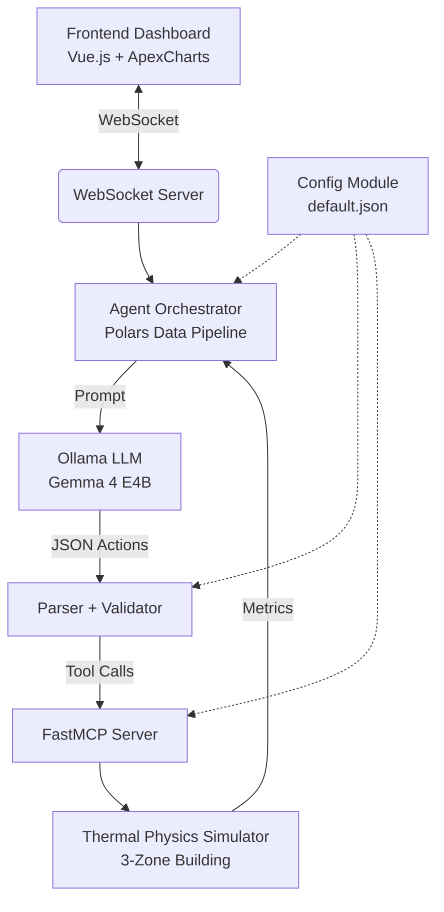

# EcoPulse: Intelligent Building Management System

EcoPulse is a state-of-the-art Agentic AI Building Management System. It pairs a sophisticated deterministic thermal physics simulator with an autonomous LLM reasoning agent capable of optimizing building energy consumption while maintaining optimal thermal comfort (ISO 7730 PMV standards).

## Architecture



## Prerequisites

- **Python 3.11+** with [`uv`](https://docs.astral.sh/uv/) (Fast Python package manager)
- **Node.js 18+** with `npm`
- **Ollama** installed locally with the `gemma4:e4b` model pulled (`ollama pull gemma4:e4b`)

## Quick Start

1. **Clone & install dependencies:**
   ```bash
   # Backend
   cd backend
   uv sync
   cd ..

   # Frontend
   cd frontend
   npm install
   cd ..
   ```

2. **Launch the full system:**
   ```bash
   chmod +x start.sh
   ./start.sh
   ```

3. **View the Dashboard:**
   Open your browser to [http://localhost:5173](http://localhost:5173).

You will immediately see the intelligent agent receiving real-time telemetry from the building simulator, formulating strategies based on thermal comfort metrics, and applying discrete tool-calls (adjusting HVAC setpoints, controlling ventilation, and lowering window shades) to minimize energy waste.

## Project Structure

```
backend/
  src/
    simulator/       # 3-zone thermal physics simulator (mock EnergyPlus)
    mcp_server/      # FastMCP tool server (get_building_status, set_hvac, etc.)
    agent/           # LLM orchestrator, prompt builder, parser, Polars pipeline
    websocket_server/# Real-time broadcast to frontend clients
    config/          # JSON config loader with env var overrides
    validation/      # Safety constraint enforcement layer
  tests/             # 74 unit + integration tests
frontend/
  src/
    components/      # 7 dashboard panels (Energy, Comfort, Zone Temp, etc.)
    composables/     # WebSocket connection management
    stores/          # Pinia reactive state (metrics + carbon history)
config/
  default.json       # System configuration (LLM, constraints, zones)
```

## Features

- **Physics-Based Thermal Simulator:** Simulates solar irradiance, dynamic occupancy loads, thermal mass delay, and outdoor diurnal temperature swings across 3 zones (South, North, Core).
- **MCP Server (Model Context Protocol):** Abstracts the building controls into validated JSON-schema tools (`set_hvac_temperature`, `adjust_ventilation`, `set_shading`) using the `mcp` SDK.
- **Safety Validation Layer:** Every LLM-generated command passes through constraint enforcement (temperature 20–24°C, ventilation 0–100%, shading 0–100%) before execution.
- **Polars Data Pipeline:** Raw simulator metrics are structured into typed Polars DataFrames for analysis and compact, token-efficient LLM prompting.
- **Agentic Reasoning Loop:** A local LLM evaluates the state space every 15 virtual minutes, with both fixed-interval and threshold-triggered reactive modes. Balances PMV comfort indices against carbon emission targets.
- **Glassmorphism Live UI:** Real-time metrics streaming over WebSockets, visualizing energy consumption, carbon footprint trends, zone temperatures, comfort indices, HVAC status, and the LLM's chain-of-thought reasoning via Pinia state management and Vue3-ApexCharts.
- **Structured JSON Logging:** Production-ready structured log output for observability and debugging.

## Configuration

All system parameters are configurable via `config/default.json`:

| Parameter | Default | Description |
|-----------|---------|-------------|
| `llm.model` | `gemma4:e4b` | Ollama model name (override: `ECOPULSE_LLM_MODEL` env var) |
| `llm.temperature` | `0.3` | LLM sampling temperature |
| `control_loop.interval_seconds` | `30` | Agent cycle interval |
| `constraints.temperature_min/max` | `20/24°C` | HVAC setpoint safety bounds |
| `websocket.port` | `8765` | WebSocket server port (override: `ECOPULSE_WS_PORT` env var) |

## Testing

```bash
cd backend && uv run pytest -v
```

The test suite includes **74 tests** covering:
- Thermal simulator physics (22 tests)
- Configuration loading & validation (6 tests)
- Safety constraint enforcement (8 tests)
- MCP tool registration & execution (4 tests)
- Agent prompt building, LLM parsing, Polars pipeline, orchestrator (23 tests)
- WebSocket server connectivity & broadcast (3 tests)
- Full backend integration with mocked LLM (2 tests)
- And 6 more across remaining modules
