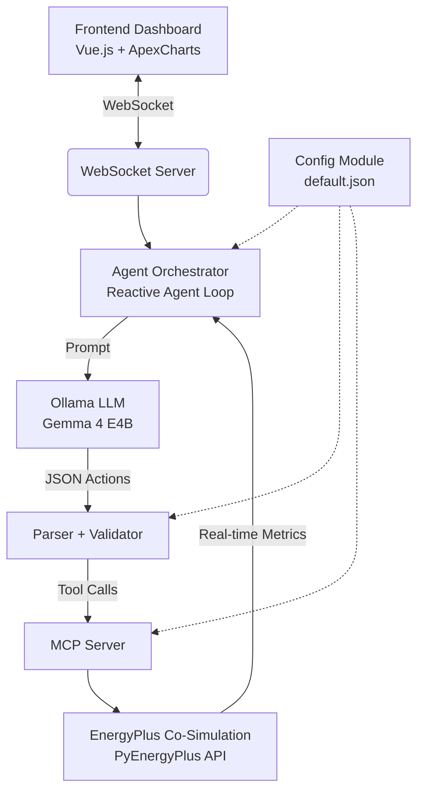

# EcoPulse: Intelligent Building Management System 🌍⚡
**Version 1.0.0 (Hackathon Submission)**

EcoPulse is a state-of-the-art Agentic AI Building Management System. It pairs a sophisticated deterministic thermal physics simulator with an autonomous LLM reasoning agent capable of optimizing building energy consumption while maintaining optimal thermal comfort (ISO 7730 PMV standards).

## Architecture



## Prerequisites

- **Python 3.11+** with [`uv`](https://docs.astral.sh/uv/) (Fast Python package manager)
- **Node.js 18+** with `npm`
- **Ollama** installed locally with the `gemma4:e4b` model pulled (`ollama pull gemma4:e4b`)

## Quick Start

1. **Clone & install dependencies:**
   ```bash
   # Backend
   cd backend
   uv sync
   cd ..

   # Frontend
   cd frontend
   npm install
   cd ..
   ```

2. **Launch the full system:**
   ```bash
   chmod +x start.sh
   ./start.sh
   ```

3. **View the Dashboard:**
   Open your browser to [http://localhost:5173](http://localhost:5173).

You will immediately see the intelligent agent receiving real-time telemetry from the building simulator, formulating strategies based on thermal comfort metrics, and applying discrete tool-calls (adjusting HVAC setpoints, controlling ventilation, and lowering window shades) to minimize energy waste.

## Project Structure

```
backend/
  src/
    simulator/       # True EnergyPlus co-simulation adapter (ep_adapter.py)
    mcp_server/      # MCP tool server exposing EnergyPlus control tools
    agent/           # LLM orchestrator, reactive loop, constraint bounds
    websocket_server/# Real-time broadcast to frontend clients
    config/          # JSON config loader with env var overrides
    validation/      # Safety constraint enforcement layer
  tests/             # 74 unit + integration tests
frontend/
  src/
    components/      # 7 dashboard panels (Energy, Comfort, Zone Temp, etc.)
    composables/     # WebSocket connection management
    stores/          # Pinia reactive state (metrics + carbon history)
config/
  default.json       # System configuration (LLM, constraints, zones)
```

## Features

- **EnergyPlus Co-Simulation Engine:** Replaces mock engines with an actual EnergyPlus (`pyenergyplus`) 5-zone commercial building simulation (`expanded.idf`). It dynamically reads accurate weather data (`weather.epw`) and physical thermal interactions.
- **MCP Server (Model Context Protocol):** Abstracts the building controls into validated JSON-schema tools (`set_hvac_temperature`, `adjust_ventilation`, `set_shading`) using the `mcp` SDK.
- **Safety Validation Layer:** Every LLM-generated command passes through strict constraint enforcement (e.g. bounding PMV thermal comfort) before injection back into EnergyPlus.
- **Agentic Reasoning Loop:** A local LLM evaluates the state space natively. It utilizes a Reactive Control Loop to only invoke LLM queries when threshold comfort metrics trigger, severely reducing latency.
- **Glassmorphism Live UI:** Real-time metrics streaming over WebSockets, visualizing true Facility Power consumption, carbon footprint trends, zone temperatures, PMV comfort indices, and LLM's chain-of-thought reasoning via Pinia and Vue3-ApexCharts.
- **Structured JSON Logging:** Production-ready structured log output for observability and debugging of simulation runs.

## Configuration

All system parameters are configurable via `config/default.json`:

| Parameter | Default | Description |
|-----------|---------|-------------|
| `llm.model` | `gemma4:e4b` | Ollama model name (override: `ECOPULSE_LLM_MODEL` env var) |
| `llm.temperature` | `0.3` | LLM sampling temperature |
| `control_loop.interval_seconds` | `30` | Agent cycle interval |
| `constraints.temperature_min/max` | `20/24°C` | HVAC setpoint safety bounds |
| `websocket.port` | `8765` | WebSocket server port (override: `ECOPULSE_WS_PORT` env var) |

## Testing

```bash
cd backend && uv run pytest -v
```

The test suite thoroughly validates:
- True EnergyPlus co-simulation tracking and API data scraping
- Energy consumption metrics dynamically tracking Facility Power
- Configuration loading & validation
- Safety constraint enforcement
- Agent prompt building, LLM parsing, and the reactive orchestrator
- WebSocket server connectivity & broadcast
